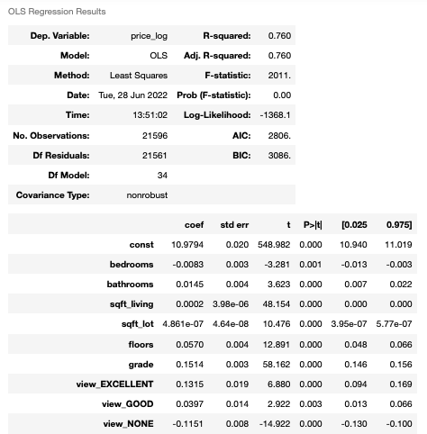
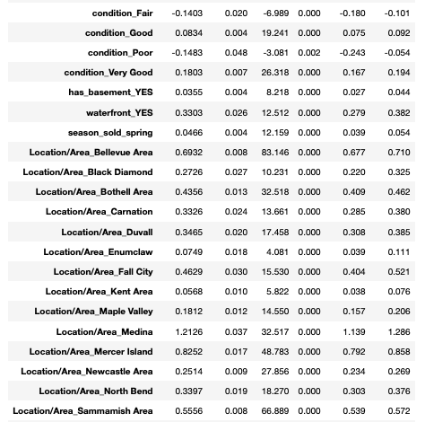
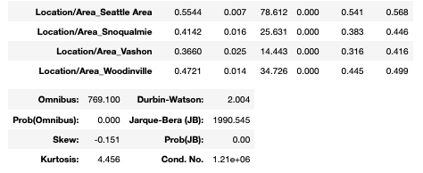
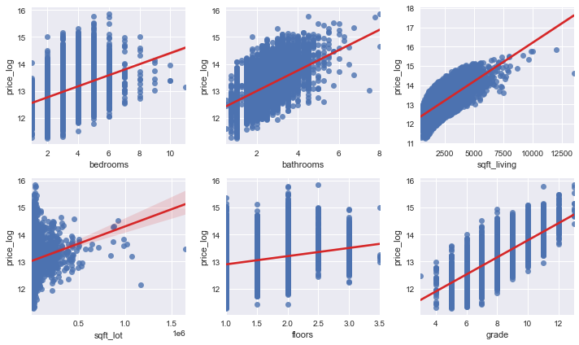
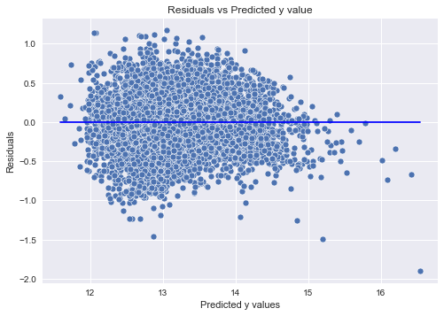

# Linear Regression Modeling of the King County House Sales dataset

## Overview

The regression modeling will yield findings to support relevant recommendations for ways renovations may increase the estimated value of a home. Those findings include:
 - an R squared metric to describe the overall model performance.
 - multicollinearity checks with VIF (Variance Inflation Factor) values 
 - visual modeling to show:
  - distribution of the model residuals 
  - linearity checks to show the relationship between Sale Price and features used
  - a homoscedasticity check of the final model. 
  
Finally, there are three feature-specific effects on Sale Price stated in the __Final Recommendations__ sections 

## Business Problem

A real estate agency needs to provide advice to homeowners about how home renovations might increase the estimated value of their homes, and by what amount.

## The Data

This regression analysis uses the King County House Sales dataset. For more information, other than what is provided below, see the [King County Assessor Website](https://info.kingcounty.gov/assessor/esales/Glossary.aspx?type=r)

## Methods

Below is a summary of how I arrived at the final model:
- Baseline Model with highest correlated feature: ‘sqft_living’

- plot histogram of baseline model residual and a QQ-plot (moving forward, these two plots are a part of function used to model, see below)

- Log transform target: ‘price’. (All models going forward used ‘price_log’ as target variable)
- Model with ‘price_log’ and ‘sqft_living’

- Model with other features added 
- Remove features with p-values greater than .05: 
 - ‘season_sold_winter’
 - ‘season_sold_summer’
 - ‘view_fair’
- Model with 3 said features removed. P-values stayed under .05
- Check for collinearity, removed 1 feature based on high VIF: ‘sqft_above’
- Model with VIF feature removed, ‘sqft_above’. P-values stayed under .05.
- multicollinearity check again. Drop one more feature: ‘sqft_living15’
- Model with additional feature dropped: ‘sqft_living15’
- This made high p value of ‘sqft_lot15’. Dropped that feature
- Model. P-values all under .05. 
- Add interactions to boost r squared 
- __FINAL MODEL__, All p-s stayed under .05. Stopped here.

From here I checked the reamaining 3 assumptions of Linear Regression (Normality checked with each model, histogram of residuals and QQ-plot) 
- Linearity: scatter plots of continuous features used in final model

- Homoscedasticity: scatter plot of final model residuals

- Independence: re check to ensure no features have VIF greater than 5

## Conclusions

The r squared value of .760 tells us this final linear regression model is able to explain 76% of the variability observed in Sale Price. With an identical adjusted r squared we can be confident in the precision and reliability of this model. 
Additionally, since the prob(f-statistic) is zero, we can also be confident there is evidence that suggests there *__is__* a linear relationship between Sale Price and this set of predictor variables. 

## Recommendations

Renovations should focus on upgrading _Condition_ and _Grade_ of the home. In addition, adding a _floor_ will increase value. 

The top ways renovations can increase home value: 
- __Upgrading home _Condition_ from AVERAGE to GOOD will increase home value by 8.3%__
- __Improvement in _Condition_ from AVERAGE to VERY GOOD will increase value by 18.0%__
- __For every increase in _Grade_ level, the home value will increase by 15.1%__
- __For every additional _Floor_, home value increases by 5.7%__
 
## Next Steps

- Remove outliers from features, one by one, modeling between each, and try to eliminate the outlying residuals shown in bottom right corner of above image.
- Split modeling data into urban and rural locations.

