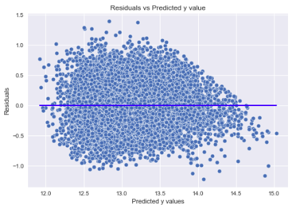

# How Renovations Can Increase the Estimated Value of a Home Located in King County Washington. 
- - -
### Linear regression of King County House Sales dataset

- - -
- - -
## Overview
The goal of this linear regression model is to offer insight as to how renovations can increase the estimated value of a home located in King County WA. A real estate company has tasked me with evaluating what features increase home sales, and by how much. This company is interested in providing homeowners with recommendations about how to invest their renovation-dollars to boost the value of their home. They want at least three specific features that boost sale price, and they would like to know by much each feature increase the value of the home.

The regression modeling will yield findings relevant to this goal, and will include:

 - multicollinearity checks with VIF (Variance Inflation Factor) values.
 - visual modeling to show:
    - distribution of the model residuals 
    - linearity checks to show the relationship between Sale Price and features used
    - a homoscedasticity check of the final model. 
 - interpretations of the final models r squared, adjusted r squared and prob(f-statistic) to evalute the final model 
 - And finally, there are three feature-specific effects on Sale Price, stated in the [Recommendations](https://github.com/AgathaZareth/PHASE2_PROJECT/blob/main/README.md#recommendations) section. 

- - -
## The Data

This regression analysis uses the King County House Sales dataset. For more information, other than what is provided below, see the [King County Assessor Website](https://info.kingcounty.gov/assessor/esales/Glossary.aspx?type=r)

    

### Features used in final model:
- price
- bedrooms
- bathrooms
- sqft_living
- sqft_lot
- floors
- grade 
- sqft_living15
- sqft_lot15
- condition
- view 

Below features were transformed to boolean categorical. 
- waterfront became waterfront_YES
- sqft_basement became has_basement_YES
- date was ultimately reduced to season_sold_SPRING
- zipcode ultimately became population_type_URBAN

- - - 
## Methods

Below is a summary of how I arrived at the final model:
### Baseline Model
- I started with a Baseline Model of the highest correlated feature: `‘sqft_living’`. And an evalutation of the distribution of residuals. 
- **NOTES:** It was obvious there was a problem with residuals. I made the choice to log transform the target variable, `'price'`

### Model using log transformed target:`'price_log'`
- Log transform target: `‘price’` >> `'price_log'`
- Model with `‘price_log’` and `‘sqft_living’`
 - **NOTES:** Big improvement in distribution of residuals however there is an obvious outlier problem. 

### Model with outliers removed from `'price'`
 - this removed 2.0% of the data

 - **NOTES:** log transformation of target did a better job at normalizing the distribution of the residuals but it had a couple extreme outliers. 
 - A choice needed to be made:
    - either stick with the outlier removed df and move forward with the way it was
    - log transform the outliers removed `'price'` 
    - or see what happens if I removed outliers from log transformed `'price_log'` (this resulted in only 1.0% data lost vs 2.0%)

### Model removing outliers from `'price_log'`

 - **NOTES:** I decided to preserve as much data as possible and moved forward with the outliers removed from log transformed price

### Additional Models and steps leading to FINAL MODEL include:
- Model with other continuous features added 
- Model with each categorical feature added to continuous data on its own
- Model with categorical features EXCEPT 'Location/Area' features (based on above modeling of each feature added on its own)
- Based on high-p-value notes I decided to rework categorical features before moving forward with modeling
- Model with new continuous (and now ordinal, from categorical) features
- Model with remaining categorical (after changing view and condition from categorical to ordinal) EXCEPT 'Location/Area' (again keeping this feature sperate)
- Model removing features with p-values greater than .05 
- Model adding in 'Location/Area' feature
- I did not like the effect this had on residual distribution
- Here I chose to rework data having to do with location. I chose to divide into Urban vs Rural. 
- Model with new feature, poplutatioin_type_URBAN, added
- P-values looked good and no more features to add so I moved on to assumption check

## FINAL MODEL  

### Assumption Checks of Final Model
- Normality: histogram of residuals and qq plot

- Linearity: scatter plots of continuous features used in final model

- Homoscedasticity: scatter plot of final model residuals

- Independence: check to ensure no features have VIF greater than 10
    

- - -
- - -

## Recommendations
### Coefficient values in more understandable way:

### Renovations should be focused on upgrading Condition and Grade of the home. Additionally, adding a basement will increase value. 

The top ways renovations can increase home value: 
- For every 1 unit increase in **_grade_** classification, the home value will increase by **16.71%**
- For every 1 unit increase in **_condition_** classification, the home will increase value by **9.58%**
- Having a **_basement_** will increase the value of the home by **13.24%**

Below I have placed reminders of the description of _GRADE_ and _CONDITION_ from [table](https://github.com/AgathaZareth/PHASE2_PROJECT/blob/main/README.md#the-data) at top of this notebook. As well as additional information from the King County [Residential Glossary of Terms](https://info.kingcounty.gov/assessor/esales/Glossary.aspx?type=r#top).

**GRADE**: _Overall grade of the house. Related to the construction and design of the house. Classification by construction quality which refers to the types of materials used and the quality of workmanship. Buildings of better quality (higher grade) cost more to build per unit of measure and command higher value. (See Glossary in Area Report for Residential Building Grades in use by the King County Department of Assessments.)_  
       
**CONDITION**: _How good the overall condition of the house is. Related to maintenance of house._ 

- - -
## Conclusions on Final Model

### P values

Up until this point P-values have been the primary focus. Rightfully so, as the measurement of how likely a coefficient is measured through our model by chance, they are undoubtably important. However, they are not the only value to focus on.

### R squared 

R-squared is the measurement of how much of the independent variable is explained by changes in our dependent variables. In our case, the *r squared* value of 0.582 tells us this final linear regression model is able to explain 58.2% of the variability observed in Sale Price. Because *r squared* will always increase as features are added, in this case 14 as shown in *Df Model*, we should also look to the *adjusted r squared* to get a better understanding of how the model is performing.

### Adjusted R squared

*Adjusted r squared* takes into account the number of features in the model by penalizing the R-squared formula based on the number of variables. If the two were significantly different it could be that some variables are not contributing to your model’s R-squared properly. In this case, the *adjusted r squared* is essentially the same as the *r squared*, just 0.1% diffence, so we can be confident in the 58% reliability, as stated above, of this model. 

### F statistic and Prob(f-statistic)

The f statistic is also important. More easily understood is the prob(f-statistic), it uses the F statistic to tell the accuracy of the null hypothesis, or whether it is accurate that the variables’ effect is 0. In our case, it is telling us 0.00% chance of this. 
 - - -
 
## Next Steps

I'd like to boost r-squared a bit higher. Finding a way to use `'yr_built'` could help. 
- - -

## Thank you!

**Email:** cassigroesbeck@emailplace.com

**GitHub:** @AgathaZareth

**LinkedIn:** linkedin.com/in/cassarra-groesbeck-a64b75229

